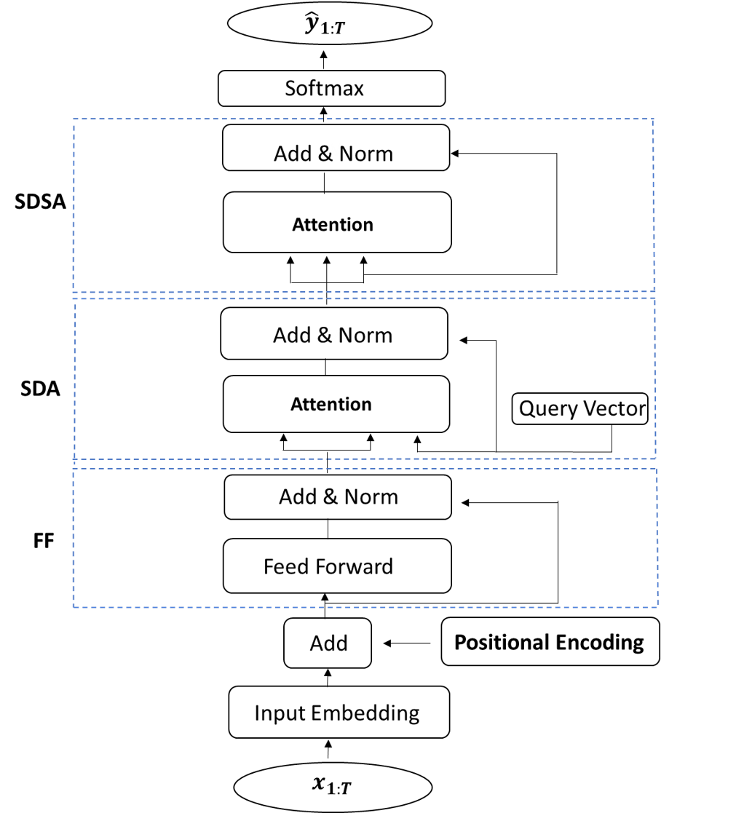
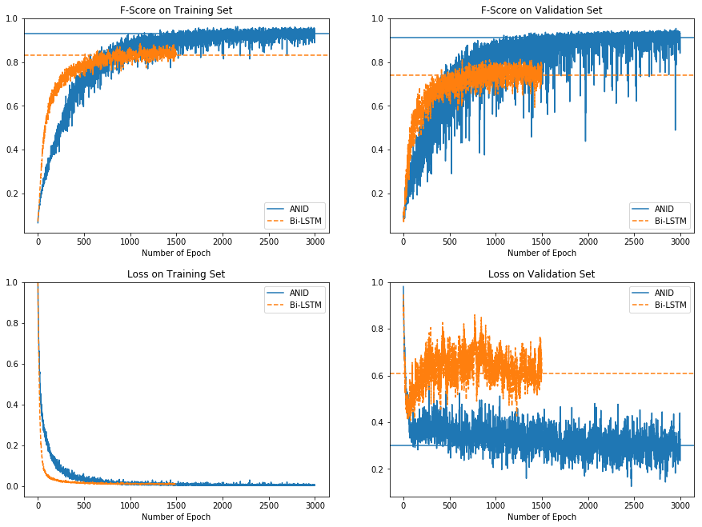

# ANID 

Experiments for the paper:

**"A Neural Attention Model for Real-Time Network Intrusion Detection"** *2019 IEEE Conference on Local Computer Networks*.
(*Camera-ready version of the paper will be uploaded soon*)

Special thanks and acknowledgement to [@greentfrapp](https://github.com/greentfrapp/attention-primer) for his implementation of
the self-attention mechanism!

## Model Description

The Attention for Network Intrusion Detection (ANID) model draws inspiration from the transformer model by [Vaswani et al. (2017)](https://arxiv.org/abs/1706.03762).
The ANID is a simple feed-forward network that does sequence-to-sequence predictions without the encoder-decoder structure used in the transformer model.

Block diagram of the ANID model:

<p align="center"></p>

The Feed Forward (FF) module, the Scaled Dot-Product Attention (SDA) module, and the Scaled Dot-Product Self-Attention (SDSA) module 
are the main components of the ANID model and their implementations can be found in `Main/attention.py`. 
These modules are the same as those in the transformer but arranged differently. 

## Software Requirements

The models are built using Tensorflow 1.8.0, Python 3.5.2 and tested in Ubuntu 16.04.

*A docker image with all the supporting software packages will be uploaded soon*

## Running the Experiments 

Please follow the steps below to run the experiments.
More specifically, the data has to be preprocessed by the scripts in `Preprocess/`
before they can be trained or evaluated using the models in `Main/`.

### Data Preprocessing

1. Download the [time slot-based Network Intrusion dataset](https://drive.google.com/file/d/1CJIOMOXjrAh9l09Qr_Y9aTSFzRFUknpf/view) that are being preprocessed
from the raw [Cicids2017](https://www.unb.ca/cic/datasets/ids-2017.html) pcap files and unzip it.
2. Create a `data/` folder and transfer all 5 downloaded csv files in.
3. Change directory to `Preprocess/` and run the `process.py` script:
```
$ cd Preprocess/
$ python process.py
```
This will output the following processed files in the `data/` folder:

```python3

# Train, Validation and Test datasets

normed_w10o9_train.h5
normed_w10o9_validation.h5
normed_w10o9_test.h5

# Indexes of the individual attacks in Train, Validation and Test

train_allattack_idx.h5
validation_allattack_idx.h5
test_allattack_idx.h5
```
The features used to create the preprocessed datasets are selected according to the
Pearson Correlation Coefficient (PCC). The details can be found `Preprocess/feature_select_pcc.ipynb`.

### Training and Evaluation

#### Train models

To train the ANID model on the `normed_w10o9_train` dataset, change directory to 
`Main/` and run:
```
$ python main.py --train --model_name <checkpoint name> --atten  
```
The above command trains an ANID model with hyperparameters reported in the paper:

- Training epochs: `--epoch 3000`
- Mini batch size: `--batch_size 256`
- Hidden dim: `--anid_hidden 100`
- Keep_prob rate: `--drop 0.9`

Simply replace the `--atten` flag with `--bilstm` to train the Bi-LSTM baseline model.

#### Test models

To evaluate a trained model on `normed_w10o9_test`, run:
```
# For ANID
$ python main.py --test --model_name <name of trained model> --atten  
```
or
```
# For Bi-LSTM
$ python main.py --test --model_name <name of trained model> --bilstm
```

### Some results

There are two saved models ( `anid` and `bilstm`) in the `checkpoint/` folder, 
by evaluating the trained ANID and Bi-LSTM models, expect F1 scores of `0.91` and `0.81` respectively.   

The losses and F1 scores evaluated on the Train and Validation datasets at each epoch during model training
are saved in the `train_records/` folder.

The plot below shows the losses and F1 scores on the two datasets when training an ANID model and a baseline Bi-LSTM model:

<p align="center"></p>
